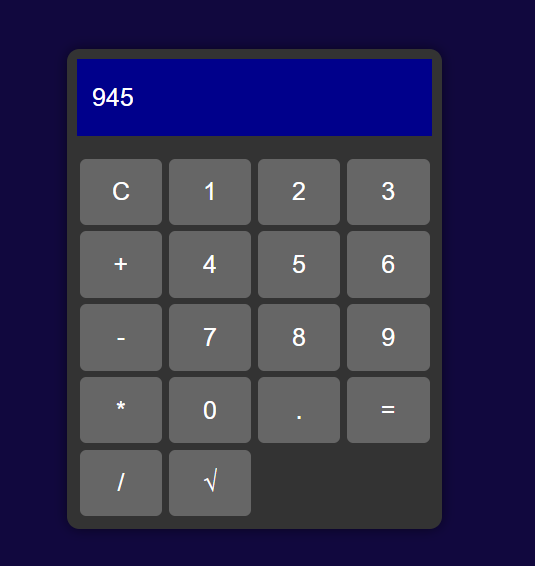

# CALCULADORA
🆎CALCULADORA SIMPLES EM HTML, CSS E JS.

  

  

Este é um projeto de uma calculadora simples desenvolvida em HTML, CSS e JavaScript. A calculadora é capaz de realizar operações básicas de adição, subtração, multiplicação e divisão, além de calcular a raiz quadrada de um número.

## Como Usar?
1. Clone este repositório para o seu computador ou baixe os arquivos diretamente.

2. Abra o arquivo `index.html` em um navegador da web.

3. Use os botões da calculadora para realizar as operações desejadas:
   - Clique nos botões de números (de 0 a 9) para inserir os números no visor.
   - Utilize os botões de operadores (+, -, *, /) para escolher a operação.
   - Pressione o botão '=' para calcular o resultado.
   - O botão 'C' limpa o visor.

4. Também é possível calcular a raiz quadrada de um número digitando o número desejado e pressionando o botão '√'.

## Funcionalidades
- A calculadora suporta operações matemáticas simples.
- Ela pode calcular a raiz quadrada de um número.
- A calculadora lida com erros e exibe 'Error' caso ocorra um problema na avaliação da expressão.
